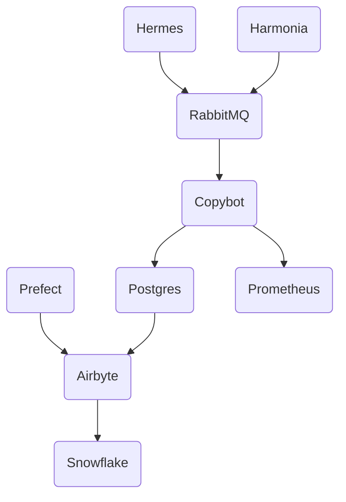

# Copybot

Ships events from RabbitMQ to Postgres for collection by Airbyte and then shipping to Snowflake.

```mermaid
graph TD;
    hermes(Hermes)
    harmonia(Harmonia)
    rabbit(RabbitMQ)
    copybot(Copybot)
    postgres(Postgres)
    prefect(Prefect)
    airbyte(Airbyte)
    snowflake(Snowflake)
    prom(Prometheus)

    hermes-->rabbit
    harmonia-->rabbit
    rabbit-->copybot
    copybot-->postgres
    copybot-->prom
    prefect-->airbyte
    postgres-->airbyte
    airbyte-->snowflake
```
